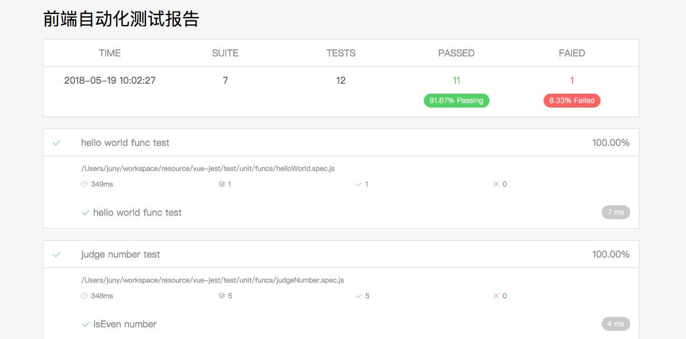
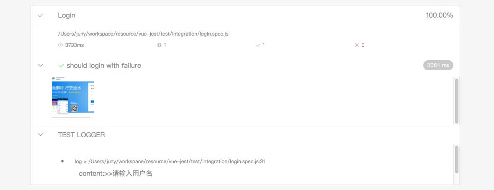

# Jest-Vue-Report

> A Jest test framework combined with Vuejs to render the test report, and a good combination with the nightmare




## Getting Started

Install it via npm:

```shell
npm install jest-vue-report
```

And include in your jest project: (If not Jest Project, you can follow [this doc](https://github.com/lenvonsam/vue-jest-test/wiki/1%E3%80%81%E5%BF%AB%E9%80%9F%E4%B8%8A%E6%89%8B) to build it as fast as your can)


The reporter integrates with Jest in form of a [testResultsProcessor](https://facebook.github.io/jest/docs/api.html#testresultsprocessor-string). Put this into your projects `package.json`:

```
"jest": {
  "testResultsProcessor": "jest-vue-report"
}
```
Then can also config custom report site, e.g. put this in your `package.json`, **(default site -> `<root>/test/jestReport` )**
```
"jest-vue-report": {
  "report-site": "test/vueReport"
}
```
With customer config, the test report will auto genente to `<root>/test/vueReport`

Then, just use Jest as usual, e.g. put this in your `package.json`

```
"scripts": {
  "test": "jest"
}
```
Then, simply run `npm test`

#### Important note:

**Built files are meant to be served over an HTTP server.**

Then, you should go to the reporter folder and use [http-server](https://www.npmjs.com/package/http-server) to build an HTTP server conveniently.


## ONE MORE IMPORTANT

There is a good combination of the nightmare screenshots with jest-vue-report

> Example

jest test file
```js
import Nightmare from 'nightmare'
import { getScreenshotUrl } from 'jest-vue-report'

jest.setTimeout(15000)

describe('Login', () => {
  let page = null
  var path = require('path')
  beforeEach(() => {
    page = Nightmare({show: true}).viewport(1024, 768)
    page.goto('http://www.xingyun361.com')
  })
  it('should login with failure', async () => {
    await page
      .click('.btn.login_btn1.l')
      .wait('#username_0')
      .click('#login_bt')
      .wait('#area_error_msg')
    await  page.screenshot(getScreenshotUrl('should login with failure'))
    const content = await page.wait('#area_error_msg')
      .evaluate(() => document.querySelector('#area_error_msg').innerHTML).end()
    await page.end()
    console.log('content:>>' + content)
    expect(content).toBe('请输入用户名')
  })
})
```

> Note: **unitName in `getScreenshotUrl(unitName)` should be unique name.**

## License

MIT
